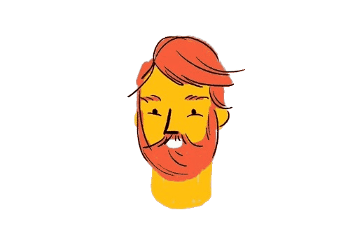

### Hello! I'm Evgenii. 

    

        
    

    

        
        
        
        
        
        
        
    
 
        

            
        

        

            
        

    <h1> 
        Thanks for stopping by! 
        
    </h1>

